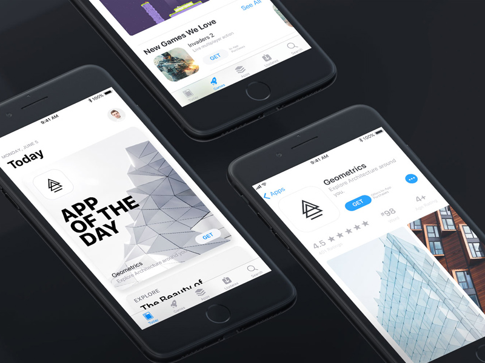

# AStore

> iOS12 버전의 앱스토어 만들어보기

[![Swift Version][swift-image]][swift-url]
[![Build Status][travis-image]][travis-url]
[![License][license-image]][license-url]



iOS 앱스토어의 기능과 디자인 그리고 추가로 음악검색 앱을 개발합니다.

## 필수 프로그램
해당 프로젝트는 Swift5.0 기반으로 작성되어 있어, 해당 프로그램이 필수로 설치되어 있어야 합니다.
- iOS SDK: 12.2+
- Xcode: 10.2+

## 설치 및 실행 방법

- 이 프로젝트는 Cocoapod 라이브러리를 사용하였습니다. 라이브러리 인스톨 후, 파일을 실행하시면 됩니다.

```sh
$POREJCT_ROOT pod install
$POREJCT_ROOT open AStore.xcworkspace
```

## 주요 개발 기능
- [Achetecture] MVC
- [Swift-lint] 코드 스타일
- [-] Autolayout
- [-] JSON Api Network
- [SD WebImage] 이미지 다운로드

더 많은 정보는 [Wiki-Story](https://github.com/interactord/AStore/wiki/Story)를 참고 해주세요

## 정보

> 문상봉 (Scott Moon)

> [Web](https://interactord.io) - [Facebook](https://facebook.com/jiwonsis)- [E-mail](interactord@gmail.com) - [Github](https://github.com/interactord)

MIT 라이센스를 준수하며 ``LICENSE.md``에서 자세한 정보를 확인할 수 있습니다.

## 업데이트 내역

프로젝트의 업데이트는 [마일스톤](https://github.com/interactord/AStore/milestones?state=closed) 과 [이슈](https://github.com/interactord/AStore/issues?q=is%3Aissue+is%3Aclosed)로 관리합니다.

보다 자세한 업데이트 내역은 [Wiki-History](https://github.com/interactord/AStore/wiki/History)를 참고 해주세요.

[swift-url]: https://swift.org/
[swift-image]:https://img.shields.io/badge/swift-5.0-orange.svg
[travis-image]: https://img.shields.io/travis/dbader/node-datadog-metrics/master.svg?style=flat-square
[travis-url]: https://travis-ci.org/interactord/AStore
[license-image]: https://img.shields.io/badge/License-MIT-blue.svg
[license-url]: LICENSE
